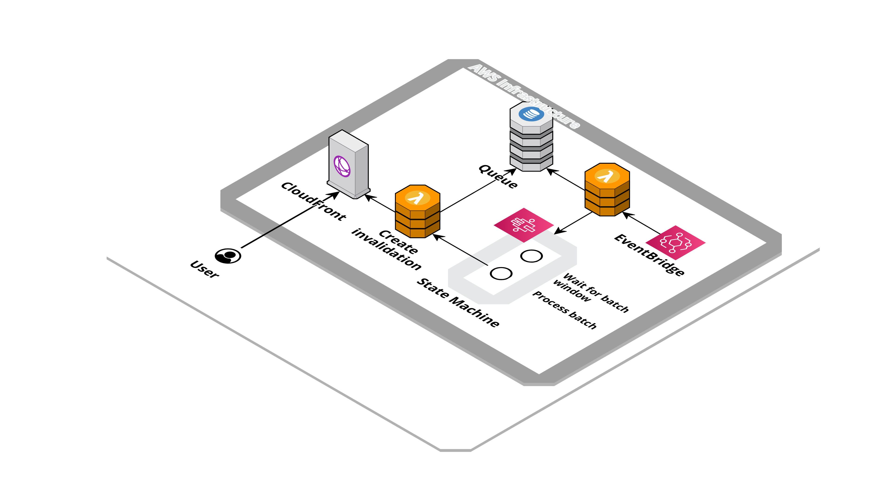

# Cloudfront invalidation queue


Collect Cloudfront invalidations in a custom queue and process them in batch.

## Created resources

Creates a Lambda function, triggered by EventBridge's event, that store the queue into a DynamoDB table and use a StepFunction state machine to orchestrate the execution of second Lambda that create the Cloudfront invalidation.



## Installation

| Region       | Deploy Link |
| ------------ | ----------- |
| eu-west-1    | [](https://eu-west-1.console.aws.amazon.com/cloudformation/home#/stacks/create/review?templateURL=https://bitbull-serverless-templates-butoamoogh8eigo.s3.eu-west-1.amazonaws.com/cloudfront-invalidation-queue/template.yml&stackName=cloudfront-invalidation-queue) |
| eu-central-1 | [](https://eu-central-1.console.aws.amazon.com/cloudformation/home#/stacks/create/review?templateURL=https://bitbull-serverless-templates-saijuozaeshae6e.s3.eu-central-1.amazonaws.com/cloudfront-invalidation-queue/template.yml&stackName=cloudfront-invalidation-queue) |
| us-east-1    | [](https://us-east-1.console.aws.amazon.com/cloudformation/home#/stacks/create/review?templateURL=https://bitbull-serverless-templates-chai7ephae5eet2.s3.us-east-1.amazonaws.com/cloudfront-invalidation-queue/template.yml&stackName=cloudfront-invalidation-queue) |
| us-east-2    | [](https://us-east-2.console.aws.amazon.com/cloudformation/home#/stacks/create/review?templateURL=https://bitbull-serverless-templates-xae9och1eipiem8.s3.us-east-2.amazonaws.com/cloudfront-invalidation-queue/template.yml&stackName=cloudfront-invalidation-queue) |

Using the [SAM CLI](https://docs.aws.amazon.com/serverless-application-model/latest/developerguide/what-is-sam.html):
```bash
sam build
sam deploy --guided
```

Including in an other SAM template:
```yaml
AWSTemplateFormatVersion: '2010-09-09'
Transform: AWS::Serverless-2016-10-31

Resources:
  CloudfrontInvalidationQueue:
    Type: AWS::CloudFormation::Stack
    Properties:
      TemplateURL: # pick a templates links from section below, based on your region
      Parameters:
        DistributionId: XXXXXXXXXXXXXXX
```

## Public templates

| Region       | Template URLs                                                                                           |
| ------------ | ------------------------------------------------------------------------------------------------------- |
| eu-west-1    | https://bitbull-serverless-templates-butoamoogh8eigo.s3.eu-west-1.amazonaws.com/cloudfront-invalidation-queue/template.yml    |
| eu-central-1 | https://bitbull-serverless-templates-saijuozaeshae6e.s3.eu-central-1.amazonaws.com/cloudfront-invalidation-queue/template.yml |
| us-east-1    | https://bitbull-serverless-templates-chai7ephae5eet2.s3.us-east-1.amazonaws.com/cloudfront-invalidation-queue/template.yml    |
| us-east-2    | https://bitbull-serverless-templates-xae9och1eipiem8.s3.us-east-2.amazonaws.com/cloudfront-invalidation-queue/template.yml    |

## Parameters

This application require some parameters when you deploy it:

- **DistributionId**:The Cloudfront distribution id to invalidate.

Optional parameters:

- **EventBusName**: The event bus from which to listen to the invalidation event.

- **BatchWindowSeconds**: The batch window in seconds.

- **BatchTTL**: The TTL value for batch, in seconds.

## Usage

Send an event to configured EventBus with DetailType as `Cloudfront Invalidation Request` and Detail as
```json
{
  "Paths": [
    "/path/to/invalidate",
    "/path/to/invalidate/",
    "/an/other/path/to/invalidate",
    "/an/other/path/to/invalidate/"
  ]
}
```

## Credits

- Repository badges by [Shields.io](https://shields.io/)
- Infrastructure schema by [Cloudcraft](https://www.cloudcraft.co/)
